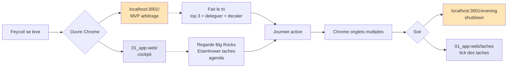
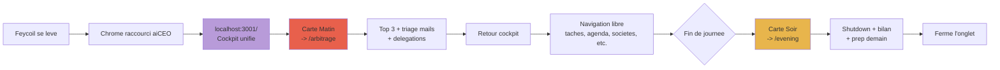
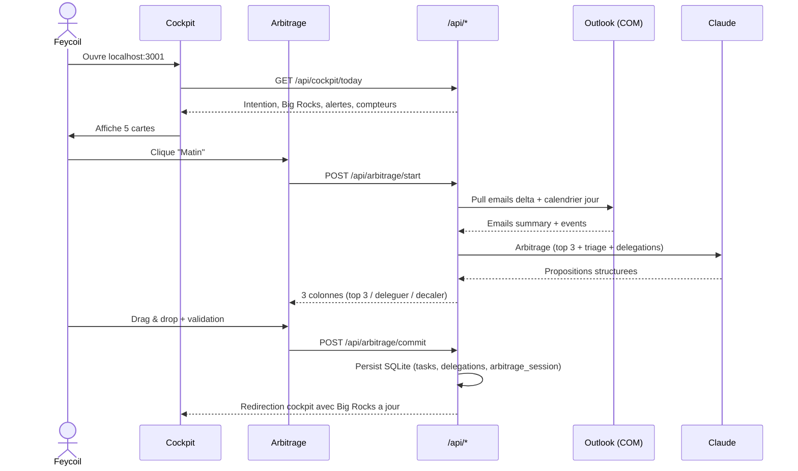
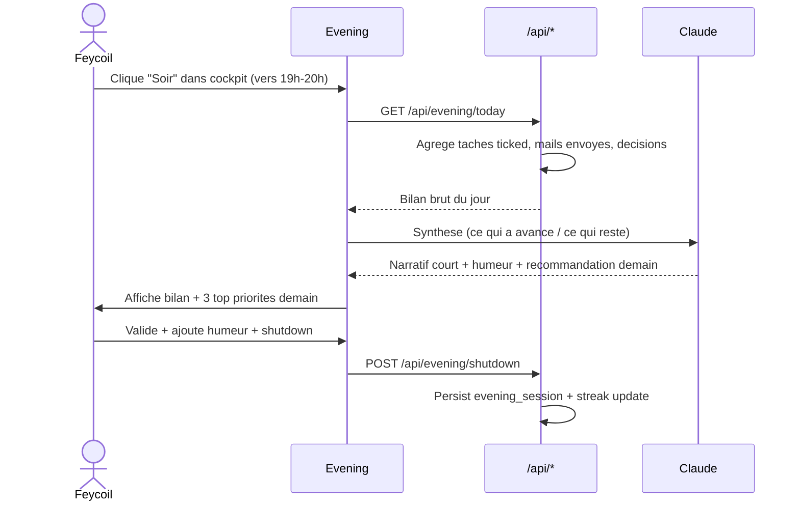
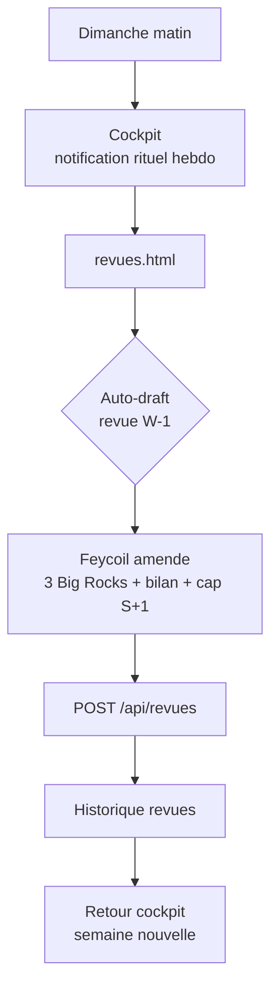
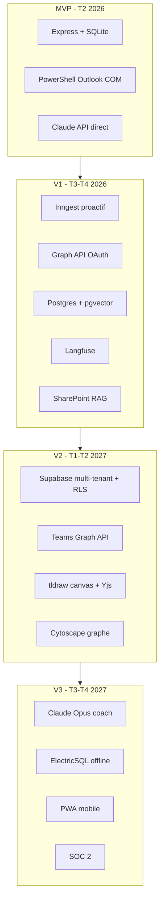

# Spec fonctionnelle — Fusion app-web + MVP

> **Statut** : Draft v1 · 2026-04-24 · Auteur : Major Fey + Claude
> **Issue GitHub** : `Spec fonctionnelle fusion app web + MVP` (label `type/docs`, `prio/P0`, `phase/mvp`)
> **Doc jumeau** : [`SPEC-TECHNIQUE-FUSION.md`](./SPEC-TECHNIQUE-FUSION.md)

## TL;DR

Deux projets parallèles cohabitent depuis la v0.4 :
- `01_app-web/` — SPA vanilla JS + localStorage (cockpit, tâches, agenda, revues, contacts, décisions, projets, groupes, assistant)
- `03_mvp/` — backend Node Express + 2 pages HTML (arbitrage matinal, boucle du soir)

On les fusionne en **un seul projet** (`03_mvp/`) qui absorbe toutes les pages web, unifie les données en SQLite, et devient l'app aiCEO de production. L'objectif MVP est un rituel quotidien impeccable (matin + soir) servi par une app qui héberge aussi tout le reste (tâches, agenda, revues, registre).

La direction cible traverse 4 phases : **MVP** (fondation unifiée, T2 2026), **V1** (copilote proactif, T3-T4 2026), **V2** (multi-tenant, T1-T2 2027), **V3** (mobile, offline, coach, T3-T4 2027).

---

## 1. Contexte de la décision

### 1.1 Pourquoi fusionner

Depuis la v0.4, l'expérience utilisateur est fragmentée :

- Les pages app-web (cockpit, tâches) stockent leurs données dans `localStorage` du navigateur. Le MVP backend lit des emails Outlook et des JSON dans `03_mvp/data/`. Les deux ne communiquent pas.
- Le cockpit `01_app-web/index.html` et l'arbitrage matinal `03_mvp/public/index.html` répondent au même moment de la journée mais avec des données différentes.
- Les sessions de délégation réalisées dans le MVP ne sont pas visibles dans `taches.html` (app-web).
- Impossible de lancer Claude (via MVP) sur les tâches saisies en app-web.

Cette fragmentation est un frein **structurant** à toute nouvelle feature (copilote proactif V1, mémoire long-terme, rituels auto). Tant qu'elle existe, chaque nouvelle brique doit choisir son camp ou pire, exister en double.

### 1.2 Direction retenue

**MVP absorbe app-web.** `03_mvp/` devient le projet unique. Les pages de `01_app-web/` sont migrées dans `03_mvp/public/`. `01_app-web/` est archivé après migration. Une seule base SQLite unifie toutes les données.

Alternatives écartées :

| Option | Pourquoi écartée |
|--------|------------------|
| app-web reste le front, MVP devient backend API | Garde 2 projets, 2 déploiements, 2 stacks à maintenir. Surface de dette double. |
| Cohabitation (2 apps distinctes) | Rallonge le problème actuel. Double maintenance long-terme. |

### 1.3 Périmètre

**Tout migrer** : cockpit, tâches, agenda, revues, contacts, décisions, projets, groupes, pages projet (×9), assistant copilote, arbitrage matinal, boucle du soir, widget W17. ~15 pages, ~4 user flows principaux.

Le MVP livre cette migration + le flux quotidien rituel impeccable. Les fonctionnalités avancées (F10 Inngest, F11 pgvector, F19 viz riches, F25 canvas) sont **V1+**.

---

## 2. État actuel (v0.4)

### 2.1 app-web (`01_app-web/`)

Application **SPA vanilla JS** avec routeur client, 15+ pages, Design System Twisty (crème + lilas + coral + gold).

```
01_app-web/
├── index.html              Cockpit — 5 cartes intention/Big Rocks/drawer
├── taches.html             Inbox tâches + Eisenhower 2×2 + CRUD
├── agenda.html             Vue hebdomadaire 7j × heures + portlets Twisty
├── revues/index.html       Revues hebdo — Big Rocks / bilan / cap
├── contacts.html           Registre équipe + recherche + filtres
├── decisions.html          Registre décisions
├── projets.html            Liste 9 chantiers
├── groupes.html            Portefeuille 4 sociétés (Adabu/Start/AMANI/ETIC)
├── assistant.html          Copilote chat (statique actuellement)
├── projet-*.html (×9)      Pages dédiées par chantier
├── revue-2026-W17-widget.html   Widget ponctuel
└── assets/
    ├── app.js              2800+ lignes — à découper en modules
    ├── data.js             Données seed (tâches, projets, contacts, etc.)
    └── app.css             Tokens Twisty + composants
```

**Persistance** : `localStorage` navigateur (clé `aiceo.state.v4`).

**État** : stable, esthétique polished (portlets, gamification, source-link, drawer latéral), navigation fluide. **Tous les CRUD passent côté navigateur**.

### 2.2 MVP (`03_mvp/`)

Backend **Node Express** + 2 pages HTML + intégration Claude API.

```
03_mvp/
├── package.json            Node 20+, express, @anthropic-ai/sdk
├── public/
│   ├── index.html          Arbitrage matinal — 3 colonnes drag & drop
│   └── evening.html        Boucle du soir — shutdown + bilan
├── src/
│   ├── server.js           Express + endpoints /api/*
│   ├── prompt.js           Prompts système arbitrage + brouillon
│   ├── llm.js              Wrapper Claude API + retries + proxy
│   ├── arbitrage.js        Logique arbitrage (top 3, triage)
│   ├── drafts.js           Génération brouillons délégation
│   └── emails-context.js   Lecture emails-summary.json
├── data/
│   ├── emails-summary.json         Emails Outlook normalisés (30j)
│   ├── calendar-YYYY-MM-DD.json    Agenda Outlook jour par jour
│   └── history/YYYY-MM-DD.json     Historique arbitrages
└── scripts/
    └── outlook-pull.ps1    PowerShell COM → JSON
```

**Persistance** : JSON fichiers dans `03_mvp/data/`.

**Intégration Outlook** : PowerShell script (`outlook-pull.ps1`) via COM qui scanne 3 boîtes, écrit JSON. Exécuté manuellement ou via Task Scheduler.

**État** :
- Arbitrage matinal : fonctionnel avec vrais emails + calendrier + Claude
- Délégation : brouillons générés côté backend, UI modale côté app-web
- Boucle du soir : fonctionnelle, simple

### 2.3 Ce que l'utilisateur fait aujourd'hui (workflow actuel)



Ce schéma expose le problème : deux mondes, deux caches, deux expériences.

---

## 3. Vision cible

### 3.1 Projet unifié

```
03_mvp/ (projet unique)
├── package.json
├── public/
│   ├── index.html               COCKPIT unifie (nouvelle accueil)
│   ├── arbitrage.html           Arbitrage matinal (ex-MVP index)
│   ├── evening.html             Boucle du soir
│   ├── taches.html              Inbox + Eisenhower
│   ├── agenda.html              Vue hebdomadaire
│   ├── revues.html              Revue hebdo + historique
│   ├── contacts.html            Registre equipe
│   ├── decisions.html           Registre decisions
│   ├── projets.html             Liste chantiers
│   ├── projet/*.html            9 pages projet (template commun)
│   ├── groupes.html             Portefeuille societes
│   └── assistant.html           Copilote chat live
├── src/
│   ├── server.js                Express
│   ├── api/                     Routes REST
│   │   ├── tasks.js
│   │   ├── decisions.js
│   │   ├── arbitrage.js
│   │   ├── drafts.js
│   │   ├── outlook.js
│   │   └── memory.js (V1+)
│   ├── db/
│   │   ├── schema.sql
│   │   ├── migrations/
│   │   └── client.js            better-sqlite3 wrapper
│   ├── llm.js                   Claude wrapper
│   ├── prompts/                 Prompts systeme
│   └── integrations/
│       ├── outlook-com.js       PowerShell wrapper (MVP)
│       └── outlook-graph.js     OAuth Entra ID (V1+)
├── data/
│   ├── aiceo.db                 SQLite base
│   └── cache/                   Caches ephemeres (emails raw, calendrier)
└── scripts/
    ├── install-service.ps1      Service Windows auto-start
    ├── migrate-from-appweb.js   Migration one-shot
    └── outlook-pull.ps1         Script PowerShell COM
```

### 3.2 Principe d'organisation

- **Une seule URL** : `http://localhost:3001/` → cockpit unifié
- **Une seule base** : `03_mvp/data/aiceo.db` (SQLite)
- **Un seul service** : node-windows ou NSSM lance Express au login Windows
- **Chrome localhost** : raccourci desktop `aiCEO.url` ouvre `http://localhost:3001/`

### 3.3 Workflow cible



Une seule adresse, un seul ensemble de données, une navigation cohérente.

---

## 4. Cartographie de migration

### 4.1 Pages app-web → MVP

| Page app-web | Page MVP cible | Priorité | Action migration |
|--------------|----------------|----------|------------------|
| `index.html` (cockpit) | `public/index.html` (cockpit unifié) | **P0** | Refonte : absorbe carte matin (arbitrage) + carte soir (evening). Garde les 5 cartes, le drawer, la gamif. |
| `taches.html` | `public/taches.html` | **P0** | Migration directe. Remplacer `loadState()/saveState()` localStorage par `fetch('/api/tasks')`. Garder Eisenhower, CRUD, filtres. |
| `agenda.html` | `public/agenda.html` | **P0** | Migration directe. Source de données : `GET /api/calendar?week=YYYY-Www`. Portlets Twisty conservés. |
| `revues/index.html` | `public/revues.html` | **P0** | Migration directe. `GET /api/revues` + nouveau `GET /api/revues/current-week` pour la revue en cours. |
| `assistant.html` | `public/assistant.html` | **P1** | Refonte : passer de statique à chat live streaming (WebSocket ou SSE vers `/api/chat`). |
| `contacts.html` | `public/contacts.html` | **P1** | Migration directe. `GET /api/contacts`. Cartes + recherche + filtres conservés. |
| `decisions.html` | `public/decisions.html` | **P1** | Migration directe. `GET /api/decisions` + CRUD. |
| `projets.html` | `public/projets.html` | **P1** | Migration directe. `GET /api/projects`. |
| `groupes.html` | `public/groupes.html` | **P1** | Migration directe. `GET /api/groups` (4 sociétés). |
| `projet-*.html` (×9) | `public/projet/:id.html` | **P2** | Template commun. Pages dynamiques (un seul HTML + router client). |
| `revue-2026-W17-widget.html` | _archive_ | — | Widget ponctuel, à archiver après migration. |

### 4.2 Pages MVP actuelles

| Page MVP actuelle | Page MVP cible | Action |
|-------------------|----------------|--------|
| `public/index.html` (arbitrage) | `public/arbitrage.html` | Renommer, déplacer dans flux nouveau cockpit. |
| `public/evening.html` | `public/evening.html` | Conserver, lien depuis cockpit carte soir. |

### 4.3 Récap volumétrie

| Famille | Pages source | Pages cible | Nouveauté |
|---------|--------------|-------------|-----------|
| Cockpit / rituels | 3 (app-web index, MVP index, MVP evening) | 3 (index, arbitrage, evening) | Fusion accueil |
| Tâches / agenda | 2 | 2 | API routes |
| Revues | 2 | 1 | Widget archivé |
| Registres | 3 | 3 | Migration vers API |
| Sociétés / projets | 10 (groupes + projets + 9 pages) | 3 (groupes + projets + template) | Route dynamique |
| Copilote | 1 | 1 | Chat live |
| **Total** | **21** | **13** | Consolidation −38% |

---

## 5. User flows cibles

### 5.1 Flux matinal (P0 impeccable)



**Critères d'acceptation MVP** :
- Complet en moins de 10 minutes
- Top 3 stable (acceptation ≥ 60%)
- Délégation génère un brouillon de mail valide en moins de 5s
- Historique arbitrage persisté en JSON `data/cache/arbitrage/YYYY-MM-DD.json`

### 5.2 Flux soir (P0 impeccable)



**Critères d'acceptation MVP** :
- Complet en moins de 5 minutes
- Adoption ≥ 70% des jours ouvrés (tracking)
- Streak persisté et affiché dans cockpit

### 5.3 Flux journée (navigation courante)

Le cockpit est le hub. Depuis le cockpit, accès direct à :
- Tâches (inbox + Eisenhower)
- Agenda (vue hebdo)
- Sociétés/projets (groupes, projets, pages projet)
- Registres (contacts, décisions)
- Copilote (assistant chat)

Navigation via sidebar (persistée, même pattern que v0.4) ou Command palette `⌘K`.

### 5.4 Flux hebdomadaire (dimanche)



**Critères d'acceptation MVP** :
- Auto-draft basé sur les arbitrages + soirs + tâches ticked de la semaine
- Temps de complétion < 15 min
- Adoption ≥ 80% des dimanches (tracking)

---

## 6. Doublons résolus

| Doublon v0.4 | Résolution |
|--------------|-----------|
| Cockpit app-web `index.html` vs MVP `index.html` (arbitrage) | Cockpit v0.4 devient accueil. Arbitrage devient `/arbitrage` (carte matin). |
| Tâches app-web localStorage vs engagements détectés dans mails MVP | Table unique `tasks`. Source de création : UI, arbitrage matinal, détection mails (V1). |
| Délégation modale app-web (`drafts.js`) vs génération brouillon MVP | Flux unifié : `POST /api/drafts/generate` depuis n'importe quelle page. |
| Agenda app-web (données seed) vs calendrier Outlook MVP | Source unique : cache Outlook synchronisé, servie par `GET /api/calendar`. |
| Historique arbitrages MVP JSON vs absence d'historique app-web | Historique migré en table `arbitrage_sessions`, visible depuis `/revues` et `/cockpit`. |
| Revues hebdo v0.4 (statique) vs absence dans MVP | Revues unifiées, auto-draftées V1, stockées en table `weekly_reviews`. |

---

## 7. Critères d'acceptation MVP

Pour que la fusion soit considérée complète et livrable en v0.5 MVP :

### 7.1 Fonctionnel
- Les 13 pages cibles sont accessibles à `http://localhost:3001/*`
- Toutes les données passent par SQLite (aucun `localStorage` sauf paramètres UI légers)
- Le flux matinal et le flux soir sont stables 5/5 jours ouvrés
- La navigation entre pages est fluide (moins de 500ms en local)
- Le cockpit reflète les données live SQLite sans refresh manuel

### 7.2 Migration données
- Script `migrate-from-appweb.js` importe sans perte :
  - Tâches existantes (localStorage + data.js)
  - Décisions, contacts, projets, groupes existants
  - Historique JSON MVP (`03_mvp/data/history/*.json`)
- Les données post-migration sont vérifiables via `node scripts/check-migration.js`

### 7.3 Non-régression
- Tous les comportements v0.4 fonctionnels sont préservés
- Le Design System Twisty est conservé (tokens, composants, portlets)
- La Command palette ⌘K reste opérationnelle
- L'UX de chaque page migrée est identique ou améliorée (jamais dégradée)

### 7.4 Déploiement
- Service Windows opérationnel (`install-service.ps1`)
- Raccourci desktop `aiCEO.url` créé
- Arrêt propre avec `sc stop aiCEO`
- Logs rotatifs accessibles (`data/logs/aiceo.log`)

---

## 8. Horizon V1-V3 (indicatif)

Cette spec couvre **le MVP**. Pour mémoire, la roadmap post-MVP enrichit l'architecture retenue sans la remettre en cause :

### 8.1 V1 — Copilote proactif (T3-T4 2026)

- **F10 Inngest** : jobs schedulés + webhooks, sub-agents pour mail/cal/tâche/délégation/préparation/revue.
- **F11 pgvector** : migration SQLite → Postgres Supabase pour la mémoire long-terme vectorielle.
- **F14 Langfuse** : tracabilité complète des appels Claude.
- **F15 SharePoint RAG** : indexation docs, Voyage-3 embeddings.
- **F12 Rituel dimanche auto-draftée** : auto-synthèse hebdo.

### 8.2 V2 — Multi-tenant (T1-T2 2027)

- **F20 RLS Supabase** : isolation par organisation, rôles CEO/DG/AE/manager/collab.
- **F21 Vues rôle-spécifiques** : chaque rôle voit son périmètre.
- **F22 Délégation end-to-end** : la tâche apparaît chez le destinataire.
- **F23 Teams** : intégration Graph Teams.
- **F25 Canvas tldraw + agent visible** : pensée graphique collaborative.
- **F28 SOC 2** : certification (migrée de V2 à V3, voir backlog).

### 8.3 V3 — Coach + Mobile (T3-T4 2027)

- **F29 Coach conversationnel** : modes arbitrage / coincé / revue stoïque.
- **F31 Détection burnout active** : interventions graduées.
- **F34 Offline-first** : ElectricSQL ou PowerSync.
- **F35 App mobile PWA** : compagnon mobile.
- **F36 Multi-CEO** : ouverture 2-3 CEO.

### 8.4 Diagramme de l'architecture V1-V3



La spec technique jumelle détaille l'architecture cible qui supporte ce parcours (voir [`SPEC-TECHNIQUE-FUSION.md`](./SPEC-TECHNIQUE-FUSION.md)).

---

## 9. Risques fonctionnels

| Risque | Probabilité | Impact | Mitigation |
|--------|-------------|--------|------------|
| Migration perd des tâches localStorage | Moyenne | Fort | Script `check-migration.js` + export JSON backup avant migration + dry-run |
| Feycoil décroche pendant les 10 sem de fusion (6 sprints, voir [`08-roadmap.md §3.2`](./08-roadmap.md)) | Faible | Fort | Livraison par vagues (cockpit + tâches en 1ère vague) pour garder l'usage quotidien — cf. S1 atelier cohérence "continuité d'usage" |
| Régression UX sur pages migrées | Moyenne | Moyen | Screenshots v0.4 avant migration + QA visuel page par page |
| Adoption flux matin/soir < 60% | Moyenne | Fort | UX psycho : jamais bloquant, toujours optionnel, streak visible discret |
| Complexité service Windows | Moyenne | Moyen | Fallback : lancer Node manuellement depuis raccourci .bat. Service optionnel. |

---

## 10. Prochaines étapes

1. **Valider cette spec** avec Feycoil (revue + amendements)
2. **Lire la spec technique jumelle** ([`SPEC-TECHNIQUE-FUSION.md`](./SPEC-TECHNIQUE-FUSION.md)) pour l'implémentation
3. **Découper en issues tactiques** si pas déjà fait (ref épic `[F1-F42]` + tactiques existantes)
4. **Démarrer la fusion** — **6 sprints sur 10 sem** (plan canonique post-S4 atelier cohérence, voir [`SPEC-TECHNIQUE-FUSION.md §13`](./SPEC-TECHNIQUE-FUSION.md) et [`08-roadmap.md §3.2`](./08-roadmap.md)). Décomposition indicative par vagues fonctionnelles :
   - Vagues 1-2 (~Sprint 1-2) : Backend API routes tâches/décisions/contacts + migration script + cockpit unifié
   - Vagues 2-3 (~Sprint 2-3) : Pages tâches + agenda + revues migrées
   - Vagues 3-4 (~Sprint 4-5) : Pages groupes + projets + contacts + décisions migrées
   - Vagues 4-5 (~Sprint 5-6) : Assistant chat live + service Windows + tests e2e + hardening
5. **Scellement MVP** : v0.5 release avec toutes les pages migrées, flux matin/soir stables, équipe 2,6 ETP / budget ~110 k€ (voir [`08-roadmap.md §3.2bis`](./08-roadmap.md))

---

*Doc Draft v1 — 2026-04-24 — à relire et amender avant scellement.*
