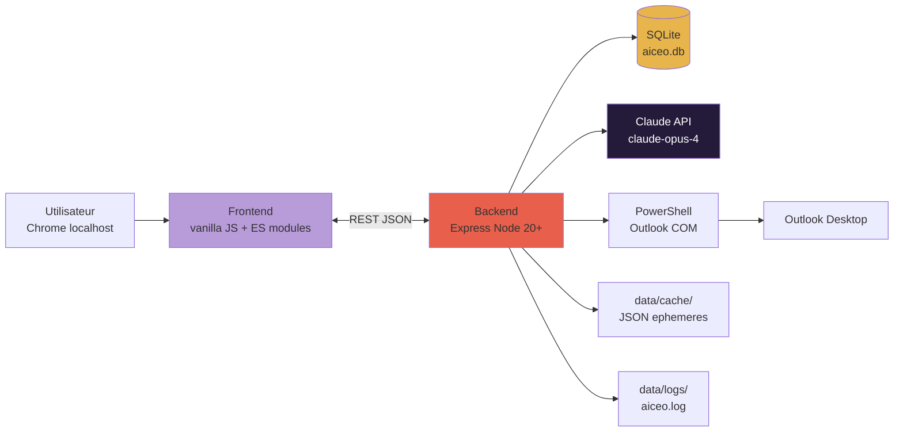
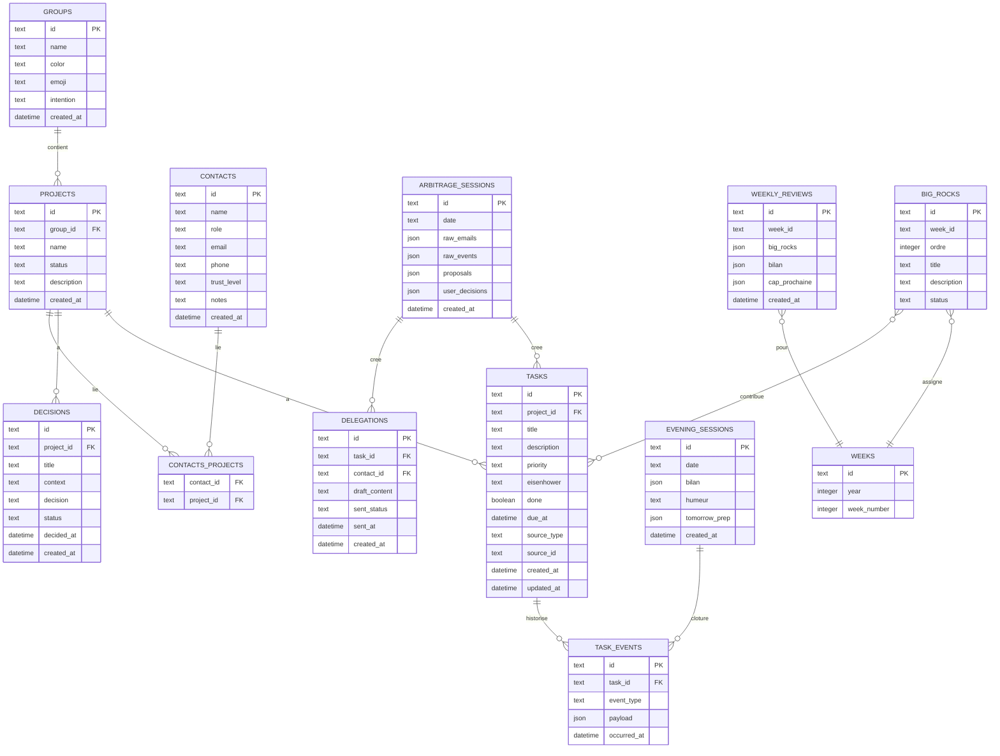
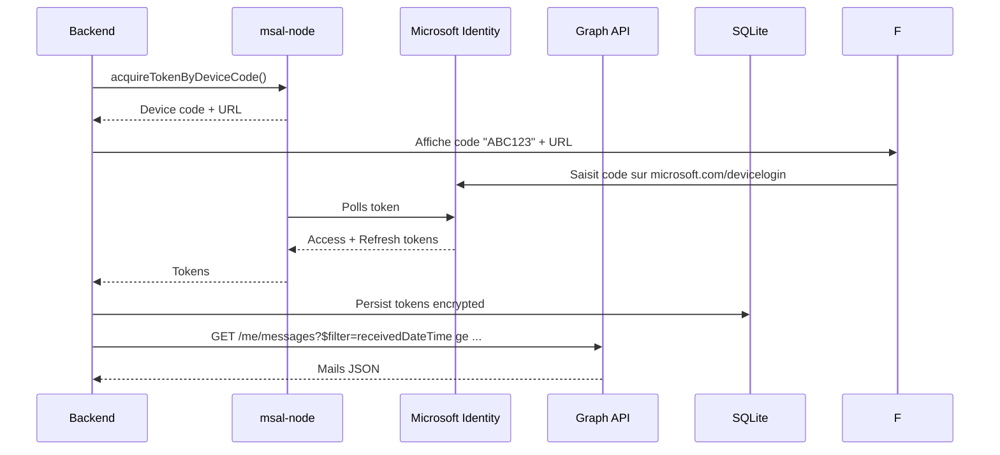
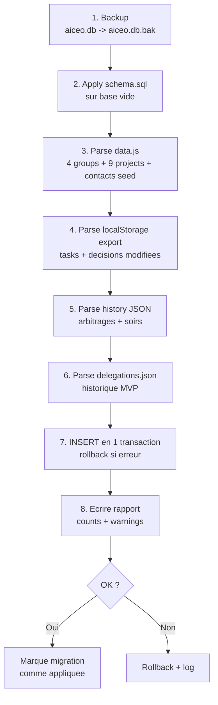
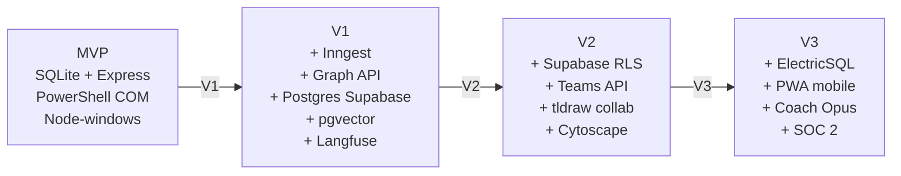

# Spec technique — Fusion app-web + MVP

> **Statut** : Draft v1 · 2026-04-24 · Auteur : Major Fey + Claude
> **Issue GitHub** : `Spec technique fusion app web + MVP` (label `type/docs`, `prio/P0`, `phase/mvp`, `domain/tech`)
> **Doc jumeau** : [`SPEC-FONCTIONNELLE-FUSION.md`](./SPEC-FONCTIONNELLE-FUSION.md)

## TL;DR

Architecture cible MVP :

- **Front** : vanilla JS + modules ES, Design System Twisty conservé, pas de framework (F17 muté en research).
- **Backend** : Node 20+ Express, REST API, prompts Claude côté serveur.
- **Données** : SQLite via `better-sqlite3` (base unique `aiceo.db`).
- **Outlook MVP** : PowerShell COM (existant), migration vers Graph API OAuth V1.
- **Déploiement** : service Windows (`node-windows` ou NSSM) + Chrome raccourci `http://localhost:3001/`.
- **Tests** : Vitest (unit backend) + Playwright (e2e 3 flux critiques).

L'architecture supporte la trajectoire complète MVP → V3 avec des transitions localisées :
- V1 : ajoute Inngest + Postgres (migration SQLite) + Graph API.
- V2 : ajoute Supabase multi-tenant + RLS + Teams.
- V3 : ajoute ElectricSQL + PWA.

---

## 1. Contexte technique

### 1.1 État actuel v0.4

**app-web** : SPA vanilla JS servie statiquement. `assets/app.js` concentre 2800+ lignes (routeur client, CRUD, rendu). Stockage `localStorage`. Pas de backend dédié.

**MVP** : Node 20, Express, `@anthropic-ai/sdk`. Scripts `outlook-pull.ps1` PowerShell COM pour scan Outlook vers JSON. Pas de DB. Pas de tests. Pas de CI.

**Doublons techniques** :
- Données tâches : `localStorage` (app-web) + aucune persistance backend (MVP).
- Emails : `03_mvp/data/emails-summary.json` (MVP) + aucune vue dans app-web.
- Calendrier : `03_mvp/data/calendar-*.json` (MVP) + vue statique en app-web (`data.js` seeds).

### 1.2 Dette identifiée à résorber avec la fusion

- `app.js` monolithique → découpage en modules ES (`cockpit.js`, `taches.js`, etc.)
- `console.log` partout → logging structuré (Winston ou Pino)
- Aucun test → Vitest unit + Playwright e2e
- Aucun CI → GitHub Actions lint + tests
- `.env` non rotationné → documenté dans `00_BOUSSOLE/GOUVERNANCE.md`

---

## 2. Architecture cible

### 2.1 Vue macro



### 2.2 Vue détaillée

```mermaid
flowchart TB
    subgraph CLIENT[Client - Chrome localhost:3001]
        HTML[HTML pages<br/>cockpit, taches, agenda, etc.]
        JS[Modules ES<br/>cockpit.js, taches.js, api.js]
        CSS[CSS Twisty<br/>tokens + composants]
    end

    subgraph SERVER[Server - Node 20 Express]
        R[Router Express]
        R --> API_TASKS[/api/tasks]
        R --> API_DEC[/api/decisions]
        R --> API_ARB[/api/arbitrage]
        R --> API_DRAFT[/api/drafts]
        R --> API_CAL[/api/calendar]
        R --> API_MAIL[/api/mails]
        R --> API_REVUE[/api/revues]
        R --> API_COCK[/api/cockpit]
    end

    subgraph DATA[Data Layer]
        CLIENT_DB[db/client.js<br/>better-sqlite3]
        SQLITE[(aiceo.db)]
        CLIENT_DB --> SQLITE
    end

    subgraph INTEG[Integrations]
        LLM_MOD[llm.js<br/>Claude wrapper]
        OUTLOOK_COM[outlook-com.js<br/>PowerShell wrapper]
        OUTLOOK_GRAPH[outlook-graph.js<br/>V1+]
    end

    HTML --> JS
    JS -->|fetch| R
    API_TASKS --> CLIENT_DB
    API_DEC --> CLIENT_DB
    API_ARB --> CLIENT_DB
    API_ARB --> LLM_MOD
    API_DRAFT --> LLM_MOD
    API_MAIL --> OUTLOOK_COM
    API_CAL --> OUTLOOK_COM

    style HTML fill:#B89BD9
    style JS fill:#B89BD9
    style R fill:#E8604C
    style SQLITE fill:#E8B54C
    style LLM_MOD fill:#241B3A,color:#fff
```

---

## 3. Stack technique

### 3.1 Backend

| Brique | Choix | Version | Justification |
|--------|-------|---------|---------------|
| Runtime | Node.js | 20+ LTS | Déjà en place dans MVP. Performant, stable. |
| Framework HTTP | Express | ^4.x | Déjà en place. Simple, massif écosystème. |
| LLM | `@anthropic-ai/sdk` | latest | Claude API (Opus 4+ pour coach V3, Sonnet 4 pour usage quotidien). |
| DB | `better-sqlite3` | ^11.x | Sync, ultra-rapide, API propre. Pas besoin d'ORM en mono-user. |
| Logging | Pino | ^9.x | JSON structuré, rotation via `pino-roll`. Performant. |
| Validation | Zod | ^3.x | Schemas runtime pour /api/* bodies. |
| Tests unit | Vitest | ^2.x | Rapide, compat Node modules ES, coverage intégré. |
| Tests e2e | Playwright | ^1.x | Headless Chrome, robuste, debug visual. |
| Dev | Nodemon | ^3.x | Auto-reload. |

### 3.2 Frontend

| Brique | Choix | Version | Justification |
|--------|-------|---------|---------------|
| JS | Vanilla ES modules | ES2022 | Pas de build chain. Pas de framework. Garder ce qui marche. |
| CSS | Custom tokens Twisty | — | Design system existant. |
| Icons | SVG inline / Lucide statiques | — | Pas de package lourd. |
| Charts V1 | D3.js ou Plotly | — | À décider pour F19 visualisations. |
| Canvas V2 | tldraw v2 | — | Pour F25. |

### 3.3 Outils & observabilité

| Outil | Usage |
|-------|-------|
| ESLint + Prettier | Lint + format automatique |
| Husky + lint-staged | Hooks pre-commit |
| GitHub Actions | CI : lint + test + audit npm |
| Dependabot | Mises à jour dépendances |
| Better Stack (V1+) | Monitoring uptime |
| Langfuse (V1+) | Traçabilité LLM |

---

## 4. Structure du projet

### 4.1 Arborescence cible

```
03_mvp/
├── package.json
├── .env.example              Template variables (ANTHROPIC_API_KEY, PORT, etc.)
├── .env                      (git-ignored) secrets
├── .gitignore
├── .github/
│   ├── workflows/ci.yml
│   └── dependabot.yml
├── README.md                 Quickstart + architecture
├── public/                   Frontend servi statiquement par Express
│   ├── index.html            Cockpit
│   ├── arbitrage.html
│   ├── evening.html
│   ├── taches.html
│   ├── agenda.html
│   ├── revues.html
│   ├── contacts.html
│   ├── decisions.html
│   ├── projets.html
│   ├── projet.html           Template pour /projet/:id
│   ├── groupes.html
│   ├── assistant.html
│   └── assets/
│       ├── app.css           Tokens + composants Twisty
│       ├── modules/
│       │   ├── api.js        Fetch helpers (wrapper axios-like)
│       │   ├── cockpit.js
│       │   ├── taches.js
│       │   ├── agenda.js
│       │   ├── revues.js
│       │   ├── assistant.js  WebSocket chat
│       │   └── ui.js         Toast, modal, drawer, command palette
│       └── vendor/           (si libs)
├── src/                      Backend
│   ├── server.js             Entry point Express
│   ├── config.js             Chargement .env + defaults
│   ├── logger.js             Pino instance
│   ├── api/                  Routes par domaine
│   │   ├── tasks.js
│   │   ├── decisions.js
│   │   ├── projects.js
│   │   ├── groups.js
│   │   ├── contacts.js
│   │   ├── arbitrage.js
│   │   ├── drafts.js
│   │   ├── calendar.js
│   │   ├── mails.js
│   │   ├── revues.js
│   │   ├── cockpit.js
│   │   ├── chat.js           WebSocket handler
│   │   └── settings.js
│   ├── db/
│   │   ├── client.js         better-sqlite3 singleton
│   │   ├── schema.sql        DDL complet
│   │   └── migrations/       SQL versionnés YYYY-MM-DD-description.sql
│   ├── llm/
│   │   ├── client.js         Anthropic wrapper + retry + logging
│   │   └── prompts/
│   │       ├── arbitrage-system.md
│   │       ├── draft-delegation.md
│   │       ├── evening-synthesis.md
│   │       └── revue-weekly.md
│   └── integrations/
│       ├── outlook-com.js    PowerShell invoker
│       └── outlook-graph.js  (V1+) OAuth + msal-node
├── scripts/
│   ├── install-service.ps1   node-windows ou NSSM
│   ├── migrate-from-appweb.js
│   ├── check-migration.js
│   ├── outlook-pull.ps1
│   └── create-desktop-shortcut.ps1
├── data/                     Runtime (git-ignored sauf schema)
│   ├── aiceo.db              SQLite
│   ├── aiceo.db-wal
│   ├── cache/                Caches éphémères JSON
│   │   ├── emails-latest.json
│   │   ├── calendar-YYYY-Www.json
│   │   └── arbitrage/
│   │       └── YYYY-MM-DD.json
│   └── logs/
│       └── aiceo.log
└── tests/
    ├── unit/                 Vitest
    │   ├── api/
    │   ├── db/
    │   └── llm/
    ├── e2e/                  Playwright
    │   ├── arbitrage.spec.js
    │   ├── delegation.spec.js
    │   └── soir.spec.js
    └── fixtures/
        ├── outlook-mails.json
        └── outlook-events.json
```

### 4.2 Conventions

- **Modules ES** partout (`"type": "module"` dans `package.json`)
- **Imports absolus** via alias dans `package.json` (ex: `@api/tasks` → `./src/api/tasks.js`)
- **Fichiers courts** : < 300 lignes par module (refactor F1.refactor-app.js imposera)
- **Tests co-localisés** possible : `src/api/tasks.js` + `tests/unit/api/tasks.test.js`

---

## 5. Schema de données SQLite

### 5.1 Diagramme relationnel



### 5.2 DDL commenté (extrait `schema.sql`)

```sql
-- ============================================================
-- SCHEMA aiCEO v0.5 - Fusion MVP
-- ============================================================
-- Conventions :
-- - Tous les IDs sont TEXT UUIDv7 (triables chronologiquement)
-- - Timestamps en ISO 8601 UTC (TEXT)
-- - JSON stocke en TEXT, parse cote app
-- ============================================================

PRAGMA foreign_keys = ON;
PRAGMA journal_mode = WAL;  -- Meilleur concurrent read

CREATE TABLE IF NOT EXISTS groups (
    id          TEXT PRIMARY KEY,
    name        TEXT NOT NULL,
    color       TEXT,               -- hex ou nom token Twisty
    emoji       TEXT,
    intention   TEXT,
    created_at  TEXT NOT NULL DEFAULT (datetime('now'))
);

CREATE TABLE IF NOT EXISTS projects (
    id          TEXT PRIMARY KEY,
    group_id    TEXT REFERENCES groups(id) ON DELETE SET NULL,
    name        TEXT NOT NULL,
    status      TEXT CHECK(status IN ('actif','suspendu','termine','archive')) DEFAULT 'actif',
    description TEXT,
    created_at  TEXT NOT NULL DEFAULT (datetime('now'))
);

CREATE TABLE IF NOT EXISTS tasks (
    id            TEXT PRIMARY KEY,
    project_id    TEXT REFERENCES projects(id) ON DELETE SET NULL,
    title         TEXT NOT NULL,
    description   TEXT,
    priority      TEXT CHECK(priority IN ('P0','P1','P2','P3')) DEFAULT 'P2',
    eisenhower    TEXT CHECK(eisenhower IN ('UI','U-','-I','--')) DEFAULT '--',
    done          INTEGER NOT NULL DEFAULT 0,
    due_at        TEXT,
    source_type   TEXT,      -- 'mail', 'arbitrage', 'manuel', 'auto-detect'
    source_id     TEXT,      -- id externe (ex: email entry_id)
    created_at    TEXT NOT NULL DEFAULT (datetime('now')),
    updated_at    TEXT NOT NULL DEFAULT (datetime('now'))
);
CREATE INDEX IF NOT EXISTS idx_tasks_project ON tasks(project_id);
CREATE INDEX IF NOT EXISTS idx_tasks_done ON tasks(done);
CREATE INDEX IF NOT EXISTS idx_tasks_due ON tasks(due_at);

CREATE TABLE IF NOT EXISTS decisions (
    id          TEXT PRIMARY KEY,
    project_id  TEXT REFERENCES projects(id) ON DELETE SET NULL,
    title       TEXT NOT NULL,
    context     TEXT,
    decision    TEXT,
    status      TEXT CHECK(status IN ('ouverte','decidee','executee','abandonnee')) DEFAULT 'ouverte',
    decided_at  TEXT,
    created_at  TEXT NOT NULL DEFAULT (datetime('now'))
);

CREATE TABLE IF NOT EXISTS contacts (
    id           TEXT PRIMARY KEY,
    name         TEXT NOT NULL,
    role         TEXT,
    email        TEXT,
    phone        TEXT,
    trust_level  TEXT CHECK(trust_level IN ('haute','moyenne','basse','nouvelle')) DEFAULT 'moyenne',
    notes        TEXT,
    created_at   TEXT NOT NULL DEFAULT (datetime('now'))
);

CREATE TABLE IF NOT EXISTS contacts_projects (
    contact_id  TEXT REFERENCES contacts(id) ON DELETE CASCADE,
    project_id  TEXT REFERENCES projects(id) ON DELETE CASCADE,
    role        TEXT,
    PRIMARY KEY (contact_id, project_id)
);

CREATE TABLE IF NOT EXISTS weeks (
    id           TEXT PRIMARY KEY,    -- ex: '2026-W17'
    year         INTEGER NOT NULL,
    week_number  INTEGER NOT NULL
);

CREATE TABLE IF NOT EXISTS big_rocks (
    id           TEXT PRIMARY KEY,
    week_id      TEXT REFERENCES weeks(id) ON DELETE CASCADE,
    ordre        INTEGER NOT NULL,   -- 1, 2, 3 (top 3)
    title        TEXT NOT NULL,
    description  TEXT,
    status       TEXT CHECK(status IN ('defini','en-cours','accompli','rate')) DEFAULT 'defini',
    created_at   TEXT NOT NULL DEFAULT (datetime('now'))
);

CREATE TABLE IF NOT EXISTS weekly_reviews (
    id              TEXT PRIMARY KEY,
    week_id         TEXT REFERENCES weeks(id) ON DELETE CASCADE,
    big_rocks       TEXT,   -- JSON : [{id, title, bilan}]
    bilan           TEXT,
    cap_prochaine   TEXT,
    mood            TEXT,
    draft_by_llm    INTEGER NOT NULL DEFAULT 0,
    created_at      TEXT NOT NULL DEFAULT (datetime('now'))
);

CREATE TABLE IF NOT EXISTS arbitrage_sessions (
    id              TEXT PRIMARY KEY,
    date            TEXT NOT NULL,       -- YYYY-MM-DD
    raw_emails      TEXT,                -- JSON emails source
    raw_events      TEXT,                -- JSON events agenda
    proposals       TEXT,                -- JSON propositions Claude
    user_decisions  TEXT,                -- JSON decisions utilisateur
    duration_sec    INTEGER,
    created_at      TEXT NOT NULL DEFAULT (datetime('now'))
);
CREATE UNIQUE INDEX IF NOT EXISTS idx_arbitrage_date ON arbitrage_sessions(date);

CREATE TABLE IF NOT EXISTS evening_sessions (
    id              TEXT PRIMARY KEY,
    date            TEXT NOT NULL,       -- YYYY-MM-DD
    bilan           TEXT,                -- JSON bilan structure
    humeur          TEXT CHECK(humeur IN ('tres-bien','bien','neutre','tendu','difficile')),
    tomorrow_prep   TEXT,                -- JSON top 3 demain
    duration_sec    INTEGER,
    created_at      TEXT NOT NULL DEFAULT (datetime('now'))
);
CREATE UNIQUE INDEX IF NOT EXISTS idx_evening_date ON evening_sessions(date);

CREATE TABLE IF NOT EXISTS delegations (
    id             TEXT PRIMARY KEY,
    task_id        TEXT REFERENCES tasks(id) ON DELETE SET NULL,
    contact_id     TEXT REFERENCES contacts(id) ON DELETE SET NULL,
    draft_content  TEXT,
    sent_status    TEXT CHECK(sent_status IN ('draft','sent','acknowledged','failed')) DEFAULT 'draft',
    sent_at        TEXT,
    followup_at    TEXT,
    created_at     TEXT NOT NULL DEFAULT (datetime('now'))
);
CREATE INDEX IF NOT EXISTS idx_delegations_task ON delegations(task_id);

CREATE TABLE IF NOT EXISTS task_events (
    id           TEXT PRIMARY KEY,
    task_id      TEXT REFERENCES tasks(id) ON DELETE CASCADE,
    event_type   TEXT NOT NULL,   -- 'created','edited','done','deferred','delegated'
    payload      TEXT,            -- JSON contextuel
    occurred_at  TEXT NOT NULL DEFAULT (datetime('now'))
);

CREATE TABLE IF NOT EXISTS settings (
    key          TEXT PRIMARY KEY,
    value        TEXT NOT NULL,
    updated_at   TEXT NOT NULL DEFAULT (datetime('now'))
);

-- Kill switch F42 sera dans settings (key='copilote.suspended_until')
-- Streak repos F39 dans settings (key='streak.shutdown.current' + key='streak.weekends.current')

-- ============================================================
-- V1+ (migration future vers Postgres Supabase)
-- ============================================================
-- Prevoir : ajouter user_id TEXT a toutes les tables (nullable au debut)
-- Prevoir : migration vers gen_random_uuid() pour IDs
-- Prevoir : ajouter tenant_id pour multi-tenant V2
```

### 5.3 Migrations versionnées

Format : `data/migrations/YYYY-MM-DD-description.sql`.

Exemples :
- `2026-04-24-initial-schema.sql` — création de toutes les tables ci-dessus
- `2026-05-XX-add-kill-switch-settings.sql` — bootstrap valeurs par défaut

Runner : script simple `scripts/migrate.js` qui lit la table `_migrations` et applique les nouveaux fichiers en ordre.

---

## 6. API REST

> **Note — spec formelle OpenAPI** : le catalogue ci-dessous est la **source d'intention** de l'API. Sa traduction formelle en **OpenAPI 3.0** est `../03_mvp/docs/openapi.yaml` (à produire en S2 du plan audit, 12/05 → 18/05). La bascule vers une génération automatique depuis le code v0.5 (Zod + `zod-to-openapi`) est prévue en Sprint 3-4 de la fusion — à ce moment-là, le code fait foi et ce catalogue devient un résumé indicatif, pas une source canonique. ADR de référence : `2026-04-24 · Livrables dev : onboarding, OpenAPI, runbook`.

### 6.1 Conventions

- Base path : `/api/`
- Format : JSON en request body et response
- Codes HTTP standards : `200`/`201`/`204` succès, `400`/`404`/`422`/`500` erreurs
- Validation requests via Zod schemas
- Pagination : `?page=1&limit=50` (défaut 50)
- Filtrage : query params spécifiques par endpoint

### 6.2 Catalogue endpoints MVP

| Méthode | Chemin | Description |
|---------|--------|-------------|
| **Tâches** | | |
| `GET` | `/api/tasks` | Liste tâches (filtres `?project=X&done=false&eisenhower=UI`) |
| `POST` | `/api/tasks` | Crée tâche |
| `GET` | `/api/tasks/:id` | Détail tâche + événements |
| `PATCH` | `/api/tasks/:id` | Met à jour tâche |
| `DELETE` | `/api/tasks/:id` | Supprime tâche |
| `POST` | `/api/tasks/:id/toggle` | Toggle done (shortcut) |
| `POST` | `/api/tasks/:id/defer` | Reporte tâche |
| **Décisions** | | |
| `GET` | `/api/decisions` | Liste (filtres `?project=X&status=ouverte`) |
| `POST` | `/api/decisions` | Crée |
| `PATCH` | `/api/decisions/:id` | Met à jour |
| **Projets** | | |
| `GET` | `/api/projects` | Liste (avec stats tâches) |
| `GET` | `/api/projects/:id` | Détail + tâches + décisions + contacts |
| **Groupes** | | |
| `GET` | `/api/groups` | Portefeuille 4 sociétés |
| `GET` | `/api/groups/:id` | Détail + projets |
| **Contacts** | | |
| `GET` | `/api/contacts` | Liste (filtres `?trust=haute&search=adabu`) |
| `POST` | `/api/contacts` | Crée |
| `PATCH` | `/api/contacts/:id` | Met à jour |
| **Arbitrage** | | |
| `POST` | `/api/arbitrage/start` | Démarre session (pull mails + cal, appelle Claude) |
| `POST` | `/api/arbitrage/commit` | Persist décisions utilisateur, crée tâches/délégations |
| `GET` | `/api/arbitrage/today` | Session du jour (si existe) |
| `GET` | `/api/arbitrage/history?from=&to=` | Historique |
| **Soir** | | |
| `POST` | `/api/evening/start` | Démarre bilan (agrège jour) |
| `POST` | `/api/evening/commit` | Persist avec humeur + top 3 demain |
| `GET` | `/api/evening/today` | Bilan du jour |
| **Délégations** | | |
| `POST` | `/api/drafts/generate` | Génère brouillon pour tâche X + contact Y |
| `POST` | `/api/drafts/:id/send` | Envoie via Outlook COM (ou Graph V1+) |
| `GET` | `/api/drafts/:id` | Détail brouillon |
| **Calendrier** | | |
| `GET` | `/api/calendar?week=2026-W17` | Events de la semaine |
| `GET` | `/api/calendar/today` | Events du jour |
| `POST` | `/api/calendar/sync` | Force pull Outlook (delta) |
| **Mails** | | |
| `GET` | `/api/mails/inbox?limit=50` | Inbox résumée |
| `POST` | `/api/mails/sync` | Force scan Outlook (delta) |
| **Revues hebdo** | | |
| `GET` | `/api/revues` | Historique revues |
| `GET` | `/api/revues/current-week` | Revue en cours (auto-draft V1) |
| `POST` | `/api/revues` | Crée/met à jour revue |
| **Cockpit** | | |
| `GET` | `/api/cockpit/today` | Agrégat : intention + Big Rocks + compteurs + alertes |
| **Copilote** | | |
| `WS` | `/api/chat` | WebSocket pour chat streaming avec Claude |
| `POST` | `/api/chat/query` | Fallback HTTP (non-streaming) |
| **Settings** | | |
| `GET` | `/api/settings/:key` | Lit setting |
| `PUT` | `/api/settings/:key` | Met à jour |
| `POST` | `/api/settings/kill-switch` | F42 : suspend copilote |

### 6.3 Exemple payload

`POST /api/arbitrage/commit` :

```json
{
  "session_id": "018f1234-5678-7abc-defg-hijklmnopqrs",
  "top_3_tasks": [
    { "action": "accept", "proposal_id": "prop-1" },
    { "action": "accept", "proposal_id": "prop-3" },
    { "action": "edit", "proposal_id": "prop-5", "title": "Finaliser pitch ExCom" }
  ],
  "delegations": [
    { "proposal_id": "prop-7", "contact_id": "ct-amani-jean", "draft_edits": "..." }
  ],
  "deferred": [
    { "proposal_id": "prop-9", "defer_to": "2026-04-26" }
  ],
  "rejected": ["prop-11", "prop-12"]
}
```

---

## 7. Intégration Outlook

### 7.1 MVP (PowerShell COM)

Script existant `scripts/outlook-pull.ps1` :
- Scan 3 boîtes : principale + 2 déléguées
- Fenêtre : 30 jours glissants (delta avec `last-sync.json`)
- Écrit `data/cache/emails-latest.json` et `data/cache/calendar-YYYY-Www.json`
- Invoqué par backend via `child_process.spawn('powershell', [...])` dans `outlook-com.js`

Pros : aucun OAuth, fonctionne avec Outlook ouvert, zéro setup Microsoft.
Cons : bloque si Outlook fermé, pas de multi-machine, limité à COM API.

### 7.2 V1 (Graph API OAuth)

Migration vers Microsoft Graph API quand V1 démarre (Inngest proactif impose backend autonome qui tourne sans session Windows).

Plan :
1. **App registration** sur portal.azure.com (tenant ETIC)
   - Scopes délégués : `Mail.Read`, `Calendars.Read`, `User.Read`, `offline_access`
   - Device code flow (pas de redirect URI nécessaire)
2. **Librairie** : `@azure/msal-node` pour auth + `axios` pour Graph calls
3. **Stockage tokens** : `data/aiceo.db` table `msal_token_cache` (chiffré avec DPAPI Windows)
4. **Refresh automatique** : tokens renouvelés avant expiration
5. **Fallback** : si Graph API échoue, fallback sur PowerShell COM pendant période de transition



### 7.3 Abstraction commune

Interface unique `src/integrations/outlook.js` qui délègue à `outlook-com.js` (MVP) ou `outlook-graph.js` (V1+). Bascule par feature flag dans `settings` : `integration.outlook = 'com' | 'graph'`.

---

## 8. Déploiement

### 8.1 Service Windows

Installation du MVP comme service qui démarre avec le login Windows.

**Option 1 — `node-windows`** (recommandée) :

```javascript
// scripts/install-service.js
import { Service } from 'node-windows';
const svc = new Service({
  name: 'aiCEO',
  description: 'aiCEO Copilote CEO',
  script: 'C:\\_workarea_local\\aiCEO\\03_mvp\\src\\server.js',
  nodeOptions: ['--max_old_space_size=1024'],
  env: [
    { name: 'NODE_ENV', value: 'production' },
    { name: 'PORT', value: '3001' }
  ]
});
svc.on('install', () => svc.start());
svc.install();
```

**Option 2 — NSSM** (fallback) :

```powershell
nssm install aiCEO "C:\Program Files\nodejs\node.exe" "C:\_workarea_local\aiCEO\03_mvp\src\server.js"
nssm set aiCEO AppDirectory "C:\_workarea_local\aiCEO\03_mvp"
nssm set aiCEO AppEnvironmentExtra "NODE_ENV=production" "PORT=3001"
nssm start aiCEO
```

### 8.2 Raccourci desktop

Script `scripts/create-desktop-shortcut.ps1` :

```powershell
$WshShell = New-Object -ComObject WScript.Shell
$Shortcut = $WshShell.CreateShortcut("$env:USERPROFILE\Desktop\aiCEO.url")
$Shortcut.TargetPath = "http://localhost:3001/"
$Shortcut.IconLocation = "C:\_workarea_local\aiCEO\03_mvp\public\assets\favicon.ico"
$Shortcut.Save()
```

### 8.3 Cycle de vie

| Événement | Action |
|-----------|--------|
| Login Windows | Service Windows démarre automatiquement |
| Crash backend | `node-windows` redémarre automatiquement (3 retries, backoff) |
| Mise à jour code | `git pull` + `npm install` + `sc restart aiCEO` |
| Désinstallation | `node scripts/uninstall-service.js` |

### 8.4 Logs

- Emplacement : `data/logs/aiceo.log`
- Rotation via `pino-roll` : quotidienne, rétention 30 jours
- Niveau production : `info` (erreurs, requêtes, arbitrages, coûts LLM)
- Accès en live : `Get-Content data\logs\aiceo.log -Wait -Tail 50`

---

## 9. Migration des données

### 9.1 Script `migrate-from-appweb.js`

**Entrée** :
- Export JSON de `localStorage` du navigateur (clé `aiceo.state.v4`) → `migrations/input/localStorage-export.json`
- Seeds existants : `01_app-web/assets/data.js`
- Historique MVP : `03_mvp/data/history/*.json`

**Sortie** :
- `aiceo.db` initialisé avec schéma + données migrées
- Rapport : `data/migrations/report-YYYY-MM-DD.json` (comptes avant/après)

**Flux** :



### 9.2 Validation post-migration

Script `scripts/check-migration.js` :
- Compte tables principales (tasks, decisions, contacts, projects, groups)
- Vérifie cohérence : `project_id` dans `tasks` existe, `group_id` dans `projects` existe
- Rapport human-readable (pass/fail + détails)

### 9.3 Rollback

En cas d'échec, rollback simple :
```powershell
Move-Item data\aiceo.db.bak data\aiceo.db -Force
```

---

## 10. Tests

### 10.1 Unit (Vitest)

Cibles prioritaires :
- `src/api/tasks.js` — CRUD + validations Zod
- `src/api/arbitrage.js` — commit, parsing décisions
- `src/llm/client.js` — retry logic, parsing réponses, mock Claude
- `src/db/client.js` — transactions, migrations
- `src/integrations/outlook-com.js` — mock PowerShell child process

Objectif : **coverage ≥ 70%** des modules backend.

### 10.2 E2E (Playwright)

3 flux critiques automatisés :

**1. Flux arbitrage matinal** (`tests/e2e/arbitrage.spec.js`) :
- Ouvre `/arbitrage`
- Injecte fixtures (emails + events)
- Vérifie 3 colonnes affichées
- Simule drag & drop + commit
- Vérifie taches créées en DB

**2. Flux délégation** (`tests/e2e/delegation.spec.js`) :
- Clic bouton "Déléguer" sur une tâche
- Vérifie modale ouverte
- Sélectionne contact
- Clique "Générer brouillon" (mock Claude)
- Vérifie brouillon affiché
- Clique "Envoyer" (mock Outlook)
- Vérifie delegation créée en DB

**3. Flux soir** (`tests/e2e/soir.spec.js`) :
- Ouvre `/evening`
- Vérifie bilan affiché (mock data journée)
- Saisit humeur + top 3 demain
- Commit
- Retour cockpit avec données à jour

### 10.3 CI

GitHub Actions `.github/workflows/ci.yml` :

```yaml
name: CI
on: [push, pull_request]
jobs:
  test:
    runs-on: ubuntu-latest
    steps:
      - uses: actions/checkout@v4
      - uses: actions/setup-node@v4
        with: { node-version: '20', cache: 'npm' }
      - run: npm ci
      - run: npm run lint
      - run: npm test
      - run: npm audit --audit-level=high
  e2e:
    runs-on: windows-latest  # Playwright sur Windows
    needs: test
    steps:
      - uses: actions/checkout@v4
      - uses: actions/setup-node@v4
      - run: npm ci
      - run: npx playwright install chromium
      - run: npm run test:e2e
```

---

## 11. Trajectoire d'architecture

### 11.1 Transitions planifiées



### 11.2 Points de bascule

| Version | Transition | Effort | Enjeu |
|---------|-----------|--------|-------|
| MVP → V1 | SQLite → Postgres Supabase + pgvector | 1-2 sem | Migration data + tests |
| MVP → V1 | PowerShell COM → Graph API OAuth | 2-3 sem | App registration + msal setup |
| MVP → V1 | Ajout Inngest pour jobs proactifs | 1 sem | Découplage UI/jobs async |
| V1 → V2 | Ajout multi-tenant (user_id + tenant_id) | 2-3 sem | RLS Supabase + isolation |
| V2 → V3 | Ajout ElectricSQL pour offline | 2-3 sem | Sync cohérente + merge conflicts |

### 11.3 Décisions irréversibles (à prendre une fois)

- **SQLite `better-sqlite3`** : engagée pour MVP et jusqu'à V1. Changement d'ORM coûterait plusieurs semaines.
- **Vanilla JS** : engagée au moins jusqu'à mi-V1. F17 SolidJS peut être activé si problème perf avéré.
- **Express** : changement possible vers Fastify ou autre si besoin V2+, mais faible ROI.
- **Prompts côté serveur** : pas négociable (sécurité, traçabilité Langfuse V1).

### 11.4 Décisions à trancher plus tard

- Framework front V2+ : SolidJS vs React (à trancher quand multi-tenant stabilisé)
- ORM : garder SQL brut ou passer à Drizzle (à trancher à la migration Postgres V1)
- Canvas collab : tldraw vs Excalidraw pour F25 (POC à faire en V2)
- Mobile : PWA vs React Native vs Tauri Mobile pour F35 (décision V3)

---

## 12. Risques techniques

| Risque | Probabilité | Impact | Mitigation |
|--------|-------------|--------|------------|
| `better-sqlite3` incompatible Windows/Linux en prod CI | Faible | Moyen | Tests CI sur Windows Runner |
| Service Windows ne redémarre pas après crash | Moyenne | Fort | node-windows retry + monitoring Better Stack V1 |
| Migration one-shot perd des données localStorage | Moyenne | Fort | Backup JSON avant + script `check-migration.js` + rollback facile |
| Régression Outlook COM après update Windows | Moyenne | Moyen | Migration Graph API V1 = mitigation long-terme |
| Coûts LLM explosent sans kill switch | Moyenne | Fort | F42 (kill switch) prioritaire MVP, quota journalier en settings |
| WebSocket `/api/chat` ne scale pas | Faible | Faible | MVP mono-user, non critique. Refactor V2 si multi-user. |
| Module `app.js` 2800 lignes trop lourd à découper | Moyenne | Moyen | Découpage progressif par page, pas big bang |

---

## 13. Prochaines étapes

1. **Valider cette spec** avec Feycoil (revue + amendements)
2. **Lire la spec fonctionnelle jumelle** ([`SPEC-FONCTIONNELLE-FUSION.md`](./SPEC-FONCTIONNELLE-FUSION.md))
3. **Créer issues tactiques manquantes** :
   - `Init schema SQLite + migrations`
   - `Setup pino logging + rotation`
   - `Setup Vitest + première suite de tests`
   - `Setup Playwright + 3 specs e2e`
   - `Install service Windows via node-windows`
4. **Sprint 1 (2 sem) — Fondation** :
   - Schema SQLite + migrations + tests DB
   - Routes API tasks/decisions/contacts/projects/groups
   - Script migration `migrate-from-appweb.js`
   - Logging Pino structuré
5. **Sprint 2 (2 sem) — Migration pages rituels** :
   - Cockpit unifié (absorbe carte matin + carte soir)
   - `arbitrage.html` (ex MVP index) avec API
   - `evening.html` avec API
   - Flux matin + soir stables
6. **Sprint 3 (2 sem) — Migration pages business** :
   - taches, agenda, revues sur API
   - Retrait `localStorage`
7. **Sprint 4 (2 sem) — Migration pages portefeuille** :
   - groupes, projets, pages projet, contacts, décisions
   - Assistant chat live (WebSocket)
8. **Sprint 5 (1 sem) — Durcissement technique** :
   - Service Windows + raccourci desktop
   - Tests e2e Playwright 3 flux critiques (arbitrage, délégation, soir) verts
   - CI GitHub Actions verte (lint + unit + audit)
9. **Sprint 6 (1 sem) — Scellement v0.5** :
   - Tag `v0.5` + release notes internes
   - Rétro sprint + ajustement rituels Feycoil autour du produit unifié
   - Validation critères go/no-go V1 (voir `04_docs/08-roadmap.md` §3.3)
   - Communication interne (équipe étendue, ExCom ETIC)

**Budget total estimé** : **10 semaines** (6 sprints) · **~110 k€** dérivés d'une équipe à 2,6 ETP (2 fullstack + 0,3 designer + 0,3 PMO). Dérivation complète dans [`08-roadmap.md`](./08-roadmap.md) §3.2ter. ADR de référence : `00_BOUSSOLE/DECISIONS.md` · *2026-04-24 · Timing & budget v0.5 réconciliés*.

---

*Doc Draft v1 — 2026-04-24 — à relire et amender avant scellement.*
