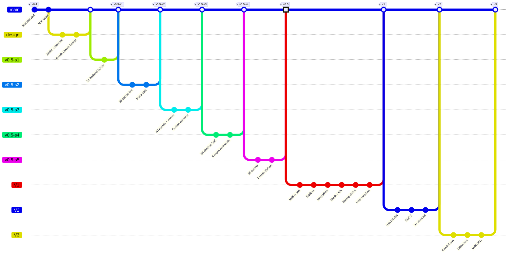

# Audit sans concession — `04_docs/11-roadmap-map.html`

> Date : 26/04/2026
> Verdict global : **5/10**. Riche en data mais échoue sur la mission "voir où on en est en 5 secondes".

## Constat global

3067 lignes, 217 ko, 4 onglets, 49 milestones, ~21 entrées journal, baseline figée, calculs d'écart automatiques, mermaid embarqué, filters, search. **Beaucoup de travail soigné**. Mais le résultat manque sa cible utilisateur principale (Feycoil + ExCom + investisseurs) qui attend une réponse rapide à "où en est le produit ?".

## 10 défauts critiques (sans concession)

### 1. Pas de vue d'ensemble en première page (BLOQUANT)

L'onglet par défaut "Carte de convergence" est une **grille 5 colonnes × N périodes**. Pour répondre à "où en sommes-nous", l'utilisateur doit :
- Scanner 5 colonnes (Période × App Web × MVP × Hub × Trajectoire)
- Décrypter les statuts ✓/◐/○
- Compter les jalons faits/restants

**Coût cognitif élevé**. La promesse "5 secondes pour comprendre" est ratée.

### 2. Données obsolètes — header trompeur

Le header affiche `v0.5-s2 · 25/04/2026`. La réalité est :
- v0.5 est livré complet le 26/04 (5 sprints, tag `v0.5` posé)
- Aujourd'hui = 26/04/2026

**Impact** : un investisseur qui ouvre la page croit qu'on est encore au sprint S2.

### 3. Pas de GitGraph (alors que c'est le format le plus parlant)

Le doc utilise des SVG custom + Mermaid pour architecture/dépendances/ADRs, mais **zéro GitGraph** alors que la trajectoire produit aiCEO est éminemment Git-shaped :
- v0.4 → branch design → branch v0.5-s1 → merge → branch v0.5-s2 → merge → … → tag v0.5
- branch V1 (6 thèmes) → merge → tag v1
- branch V2 (commercial intl) → tag v2
- branch V3 (coach + offline) → tag v3

GitGraph est le format **natif** pour ce genre de trajectoire avec versions taguées et branches parallèles. Sa présence rend immédiat ce que la grille rend laborieux.

### 4. V1 / V2 / V3 désynchronisés vs ROADMAP v3.1

Le doc présente :
- "V1 cloud-ready 290 k€" (2027)
- "V2 multi-tenant 693 k€" (2028)
- "V3 coach 598 k€" (2029-2030)

La **ROADMAP v3.1 du 26/04** dit :
- V1 = SaaS + équipes + mobile, 6 thèmes ~46 k€ binôme (T3 2026 - T1 2027)
- V2 = commercial intl + i18n + SOC 2, 800 k€ (T2-T4 2027)
- V3 = coach + offline + multi-CEO, 600 k€ (T4 2027+)

**Impact** : le doc raconte une histoire qui n'est plus à jour.

### 5. Statuts milestones obsolètes

Plusieurs milestones marqués `status:"todo"` alors qu'ils sont livrés :
- `v05-hub` "v0.5 fusion produit unifié" → todo, mais en réalité **DONE 26/04**
- `hub-prereq-onboarding-dev`, `hub-prereq-runbook`, `hub-prereq-openapi` → todo, mais reportés ou superflus post-v0.5

**Impact** : la barre de progression et le % global sont faux.

### 6. KPIs en haut trop pauvres

Header montre uniquement un % et une barre. Il manque les chiffres qui frappent :
- v0.5 LIVRÉ ✓
- 5 sprints en ~16h chrono
- 41 issues closes
- ~95 tests verts
- 110 k€ / 110 k€ budget
- Vélocité x30
- ~150 j d'avance vs BASELINE

Ces éléments existent dans le journal mais sont enfouis sous 800 lignes.

### 7. Onglets verbeux et flous

Les noms d'onglets actuels :
- "Carte de convergence" → flou. Convergence de quoi ?
- "Plan v0.5 fusion" → OK mais long
- "Release notes" → OK
- "Journal & écarts" → OK

Manque un onglet "Roadmap V1+" alors que c'est précisément ce dont a besoin l'ExCom.

### 8. Performance / lourdeur

- 217 ko pour une roadmap, c'est trop. Mermaid CDN bloquant.
- 3067 lignes mélangent CSS / HTML / JS / data. Pas de séparation propre.

### 9. Pas responsive

Grille 5 colonnes (160px + 4×1fr) qui doit s'écraser sur mobile sans alternative spécifiée. Sur tablette c'est déjà serré.

### 10. Pas de "next steps" explicite

Après avoir lu tout ça, on ne voit pas clairement :
- Qu'est-ce qui s'ouvre maintenant (V1 6 thèmes)
- Qu'est-ce qu'on attend de l'ExCom 04/05 (GO V1)
- Combien de temps avant la prochaine release

Pour un outil de pilotage, c'est manquant.

## 6 propositions de refonte sans concession

### Proposition 1 — Nouvel onglet "Vue d'ensemble" en première position et par défaut

Contenu :
1. **KPIs hero** : 7 chiffres clés en grid 4×2 (v0.5 LIVRÉ, sprints, issues, tests, budget, vélocité, avance)
2. **GitGraph Mermaid** : trajectoire produit complète v0.4 → V3 avec marqueur "Vous êtes ici"
3. **Bandeau next** : "Phase actuelle: v0.5 LIVRÉ. Prochaine: V1 6 thèmes. Action attendue: GO ExCom 04/05"
4. **Liens rapides** vers onglets détaillés

### Proposition 2 — GitGraph Mermaid en pièce maîtresse

Structure proposée :

Avec annotation visuelle "Vous êtes ici" entre `tag v0.5` et `branch V1`.

### Proposition 3 — Restructurer les onglets

Avant : `Carte convergence | Plan v0.5 | Release notes | Journal & écarts`

Après :
- **Vue d'ensemble** (nouveau, par défaut) — GitGraph + KPIs + next steps
- **v0.5 livré** (renommé Plan v0.5 fusion) — détail 5 sprints livrés
- **V1 → V3** (nouveau) — détail 6 thèmes V1 + V2 redéfinie + V3
- **Trajectoire détaillée** (renommé Carte convergence) — grille timeline pour les power users
- **Release notes** — inchangé
- **Journal & écarts** — inchangé

### Proposition 4 — Mise à jour des données

- Header : `v0.5 LIVRÉ · 26/04/2026 · binôme CEO+Claude × 30`
- Tous les milestones obsolètes passés à `done`
- V1/V2/V3 réécrits selon ROADMAP v3.1
- Ajout du bundle Claude Design v3.1 dans le tableau

### Proposition 5 — Performance

- Lazy load Mermaid (charger uniquement quand l'onglet contenant le mermaid devient actif)
- Séparer le data (MILESTONES, JOURNAL, RELEASES) en `roadmap-data.js` chargé en module
- Compression CSS (passer de ~600 lignes à ~300 par utilisation des tokens DS purs)

### Proposition 6 — Responsive minimum

- Grille 5 colonnes → empile en mobile sous forme de cards par lane
- KPIs hero passe de 4×2 à 2×4 sur mobile

## Plan d'action recommandé

**Stratégie : refonte ciblée, pas réécriture complète.**

1. **Ajouter le nouvel onglet "Vue d'ensemble"** (par défaut active) avec GitGraph + KPIs + next steps. ~150 lignes ajoutées.
2. **Mettre à jour les données obsolètes** dans le tableau MILESTONES (statuts, dates, V1/V2/V3). ~50 lignes modifiées.
3. **Mettre à jour le header** (date, version). ~5 lignes.
4. **Ajouter un onglet "V1 → V3"** avec le détail 6 thèmes + V2 + V3 selon ROADMAP v3.1. ~200 lignes.
5. **Garder les onglets existants** (carte convergence, release notes, journal) — utiles pour drill-down.

**Effort estimé** : 1 itération, ~400 lignes de code patché, gain énorme en lisibilité.

**Backup** : fichier actuel sauvé en `11-roadmap-map-v1-backup.html` avant refonte.
